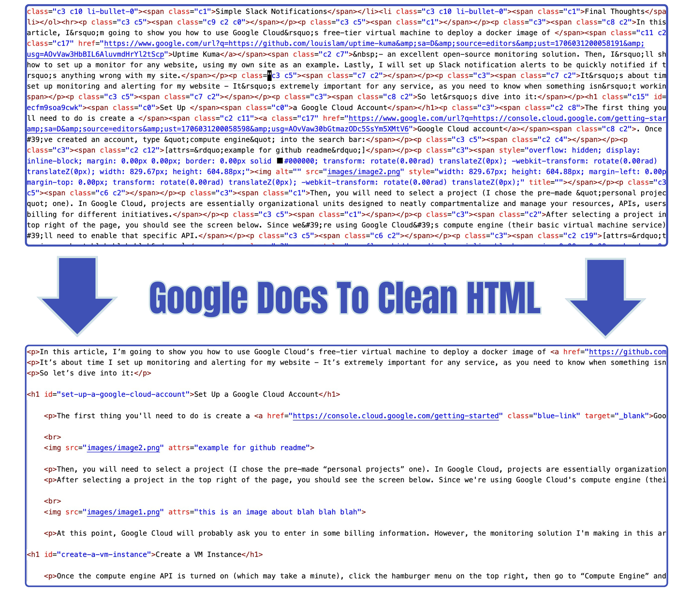
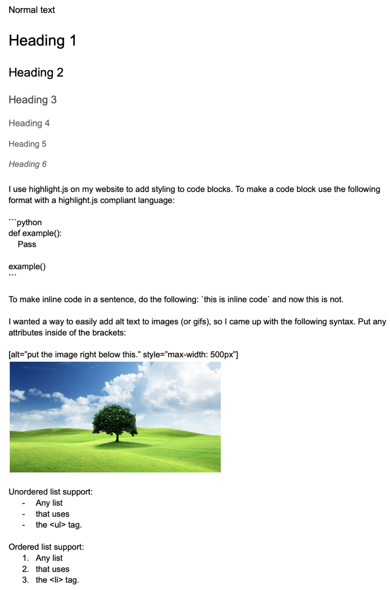

<p align="center">
    
</p>

# Google Docs To Clean HTML

This is a tool that allows you to take the messy auto-generated HTML that Google Doc's gives you, when downloading a file in HTML format, and turns it into clean and uasable HTML. This is mainly built for my [tech-blog](https://jacobpadilla.com) but I decided to make it public as others may find it useful. That being said, the program cannot clean all HTML elements (such as tables and videos) - More about what this program can clean below. 

In an effort to make this program modular and expandable, I refactored the tiny script into a package (gdtch) that uses a mixin design pattern so that it (in theory) is easy to add more features! If you find this project useful, consider contributing to it!

## How to use it

First you need to import the main class:

```python
from gdtch import Cleaner
```

Then you need to create an instance of it. The only argument that it needs is the path to the HTML file - The one you downloaded from Google Docs.

```python
cleaner = Cleaner('something_like_this/example.html')
```

When creating an instanse, the Cleaner object will read the html file and put every element from in the body into a list called self.elements. The tags are put into a Python list becuase this makes future cleaning operations easier as it allows other methods to easily iterate through the list, add elements above and below elements, and join elements together.

Currently, this project supports the following type of Google Docs styling. It's limited for now, since these are the only things that I use for my website, but hopefully by open-sourcing this, the feature-set will improve.



## How to use it
To use the program, you can pick and choose which parts of the HTML that you want to clean. As more features are added, you can add more! 

### **remove_top_of_document(self, element_break: str = 'hr') -> None:**

Remove the top part of the document. I like to make an outline on the top part of my articles and then divide the main article from the outline with a horizontal line.

## **clean_element_attributes(self) -> None:**

Get rid of the Google Docs generated attributes. This method actually calls three more methods: 

* self.remove_junk_attrs(exclude={'a', 'img'})
* self.clean_a_tag_attrs()
* self.clean_img_tag_attrs()

`a` tags and `img` tags are special because we want to keep the src attribute of the image element and parse the `a` tag attributes to extract the clean url for the `href` attribute.

### **add_class_to_element(self, /, element: str, class_attr: str = '') -> None:**

Add one or more classes to an element.

### **add_target_to_outgoing_links(self, /, origin: str, target: str) -> None:**

Add a target attribute to all of the outgoing links. For example, if I want to open all links that aren't to jacobpadilla.com, I could set origin = "jacobpadilla.com" and target to "_blank".

### **remove_span_tags(self) -> None:**

Remove the pesky `span` html elements that Google Docs puts everywhere.

### **clean_p_text(self) -> None:**

Encode the text in the `p` tags. If elements such as an `a` tag are inside of a `p` tag, the text inside of the `a` tag will still be encoded! This method also makes the quotes curley and removes extra white space between the text and end of the `p` tag.

### **generate_header_id_attributes(self) -> None:**

I generally have a table of contents on my articles and to make those, you genrally need to set the location to a fragment of the article. This is what I use this method for. It will take the text inside of the h tags, replace the spaces with a dash, make all of the text lowercase, and then set that value to the `id` of the h tag.

### **insert_inline_code(self) -> None:**

Replace two ticks with `code` elements. See the image above for more info.

### **insert_highlightjs_code_blocks(self) -> None:**

I use [Highlight.js](https://highlightjs.org/) to add colors to my multiline code blocks on my website. This method will transform a code block into a single element (takes up one slot in the self.elements Python list). Abiding by the highlight.js documentation, this method wraps the code block in `pre` and `code` elements and addeds the classes: `language-[YOUR LANGUAGE] hljs`.

### **remove_empty_tags(self) -> None:**

Remove empty tags. Google Docs will make an empty `p` for things likes blank lines.

### **alter_image_attribute(self, path_template: str = '{}') -> None:**

If you have images in your Google document, when you download the HTML, they will be stored in a directory called `images` and the `src` of the html `img` elements will be `images/image[number].jpg. This is not always what, hence this method.

Pass in a template and let this method update all of the `img` tag sources.

The template is a Python string. The original source is stored in a variable, taht you can use int he template, called `original`. 

Example: `articles/{original}` will output `articles/images/image[number].jpg

### **add_element_above_tag_type(self, /, type: str, add: str) -> None:**

Add an element above another. This method will add an lxml.html.HtmlElement one slot above another element in the self.elements list. I use this to add a `br` tag above my `img` tags because I never added margin-top to my iamges on my website :)

### **pretty_save(self, file_path: str = '.') -> None:**

write all of the lines in self.elements to a new html file. This will print the elements with indentation so that, in my opinion, it's easier to read.

## Example

This is the configuratioin that I use for the articles on my website:

```python
from gdtch import Cleaner


HTML_FILE = ''
URL_NAME = ''

cleaner = Cleaner(HTML_FILE)

cleaner.remove_top_of_document(element_break='hr')
cleaner.clean_element_attributes()
cleaner.add_class_to_element(element='a', class_attr='blue-link')
cleaner.add_target_to_outgoing_links(origin="jacobpadilla.com", target='_blank')
cleaner.remove_span_tags()
cleaner.clean_p_text()
cleaner.generate_header_id_attributes()
cleaner.insert_inline_code()
cleaner.insert_highlightjs_code_blocks()
cleaner.remove_empty_tags()
cleaner.alter_image_attribute(path_template='articles/example/{original}')
cleaner.add_element_above_tag_type(type='img', add='<br>')

cleaner.pretty_save(file_path='.')
```

## Setup

**REQUIRES PYTHON 3.12**
To use all of the features in this package, you'll need Python 3.12. The only part that needs this version is the `alter_image_attribute` method due to the `itertools.batched` function.

Clone the repo (and star it)
```
$ clone https://github.com/jpjacobpadilla/Google-Docs-To-Clean-HTML.git
```

Make a Python enviroment and pip install the package in editable mode so that you can easily make changes to the source code.
```
$ python -m venv venv
$ source venv/bin/activate
$ pip install -e .
```

Make a python file, like the example one above and then run it!

## Contributions

Contributions are welcome! If you have a suggestion or an issue, please use the issue tracker to let us know.

You can also contact me [here](https://jacobpadilla.com/contact).